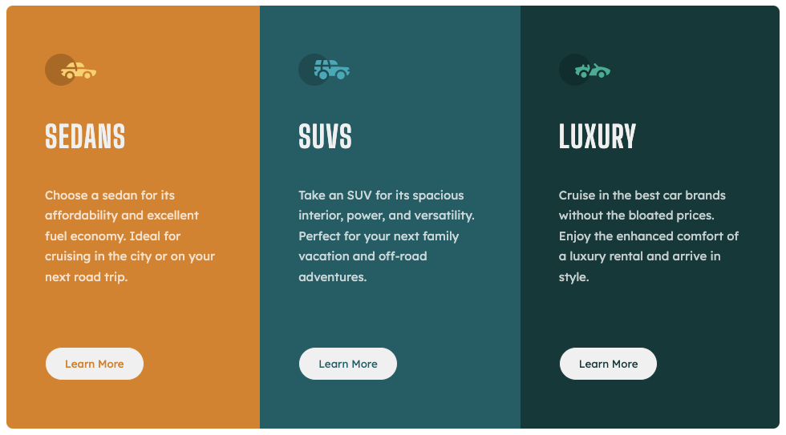

# Frontend Mentor - 3-column preview card component solution

This is a solution to the [3-column preview card component challenge on Frontend Mentor](https://www.frontendmentor.io/challenges/3column-preview-card-component-pH92eAR2-). Frontend Mentor challenges help you improve your coding skills by building realistic projects.

## Table of contents

- [Overview](#overview)
  - [The challenge](#the-challenge)
  - [Screenshot](#screenshot)
- [My process](#my-process)
  - [Built with](#built-with)
  - [What I learned](#what-i-learned)
- [Author](#author)

## Overview

### The challenge

Users should be able to:

- View the optimal layout depending on their device's screen size
- See hover states for interactive elements

### Screenshot



## My process

### Built with

- Semantic HTML5 markup
- CSS custom properties
- Flexbox
- Mobile-first workflow

### What I learned

I used the following code in order to make the buttons stop moving when hovering over them:

```css
.sedans .btn {
  color: var(--bright-orange);
  /* part of the coding to make the button stop moving when hovering */
  border: 0.2px solid var(--bright-orange);
}
```

```css
.sedans .btn:hover {
  color: var(--light-grey);
  border: 0.2px solid var(--light-grey);
  background: var(--bright-orange);
  transition: background-color 0.3s;
}
```

Also, in order to make sure the buttons were aligned to the bottom of the container at all times I used "position: relative" and position: absolute"":

```css
.car {
  padding: 3em 2.2em 8em 2.2em;
  position: relative;
}
```

```css
.btn {
  border-radius: 100px;
  padding: 0.8rem 1.6rem;
  background: var(--light-grey);
  font-family: "Lexend Deca", sans-serif;
  position: absolute;
  bottom: 3em;
}
```

Based on @vcarames feedback from frontendmentor.io, I have made the following updates:

--> Make sure that decorative images use null [alt (empty) attribute values](https://www.a11yproject.com/checklist/#make-sure-that-decorative-images-use-null-alt-empty-attribute-values)

--> Make sure to use anchor tags instead of buttons as links:

```html
<a href="#" class="btn">Learn More</a>
```

--> [Use @media(hover: hover)](https://dockyard.com/blog/2019/02/14/introducing-hover-hover) when hover is supported

--> Make sure to [use em for my media queries](https://betterprogramming.pub/px-em-or-rem-examining-media-query-units-in-2021-e00cf37b91a9)

--> And lastly, a [useful article about px vs em/rem](https://uxdesign.cc/why-designers-should-move-from-px-to-rem-and-how-to-do-that-in-figma-c0ea23e07a15)

## Author

- Frontend Mentor - [@codercreative](https://www.frontendmentor.io/profile/codercreative)
